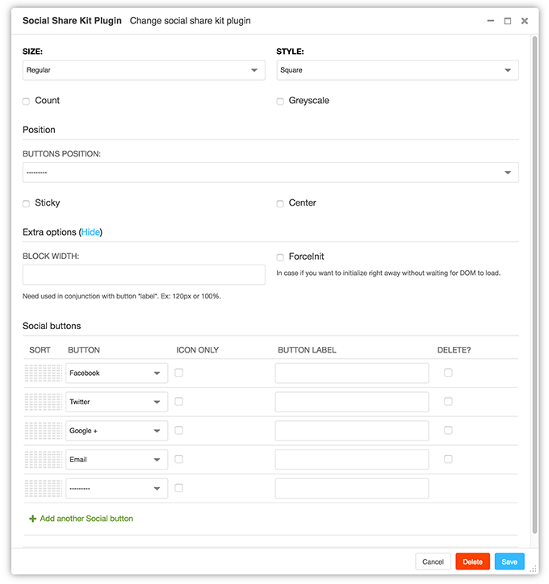
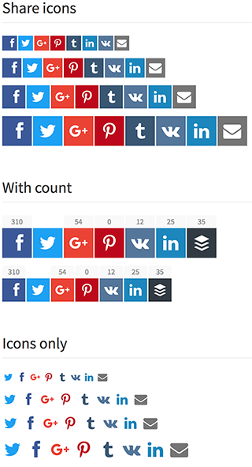

CMS Plugin Social Share Kit
===========================

**Responsive, secure, and fast share buttons.**

Django CMS Plugin integration of `Social Share Kit <http://socialsharekit.com/>`_
made by `Kaspars Sprogis <darklow@gmail.com>`_.

- Ready to add it to any PlaceholderField. Recommended in **static** placeholder.
- Possibility to add multi time on a page
- Buttons ordering easy by drag & drop
- Choice which button you want

Library of decent and good looking CSS/JavaScript social sharing icons,
buttons and popups. Using OpenGraph and Twitter meta tags for generating social popup content.

Current social buttons supported:

- Facebook
- Twitter
- Google +
- Pinterest
- Tumbr
- Linkedin
- VK
- Buffer
- Email

Global options:

- **size**:	Large, Regular, Small, Extra Small
- **style**: Square, Round, Rounded
- **count**: display by button number of sharing
- **greyscale**: display button in greyscale
- **width** for group of button, useful for column display. Need used in conjunction with button *label*.
- **forceinit**: In case if you want to initialize right away without waiting for DOM to load.
- **position**: Left side, Right side, Bottom
- **sticky**: position option
- **center**: position option

By button options:

- **label**: default *Share* or custom set by button (no multi-langues)
- **icon only**: be defined at button level (if global icon only not set)

Django CMS Plugin configuration screen:

Some example of social buttons:

For a ful live demo and more info: http://socialsharekit.com/#examples

Based on version `1.0.14 <https://github.com/darklow/social-share-kit/releases/tag/v1.0.14>`_

LICENCE:

Social Share Kit is licensed under Creative Commons Attribution-NonCommercial
3.0 license. As long as you do not use the Social Share Kit in a business or
money-making venture, it is free for your own personal use.

For this I buying for you the **Unlimited**, result you have right to use this
CMS Plugin in any unlimited commercial projects.

**EOM** licence:
Integrate Social Share Kit in your commercial project (like theme) and sell
that new project. More about source project license: http://socialsharekit.com/#license

